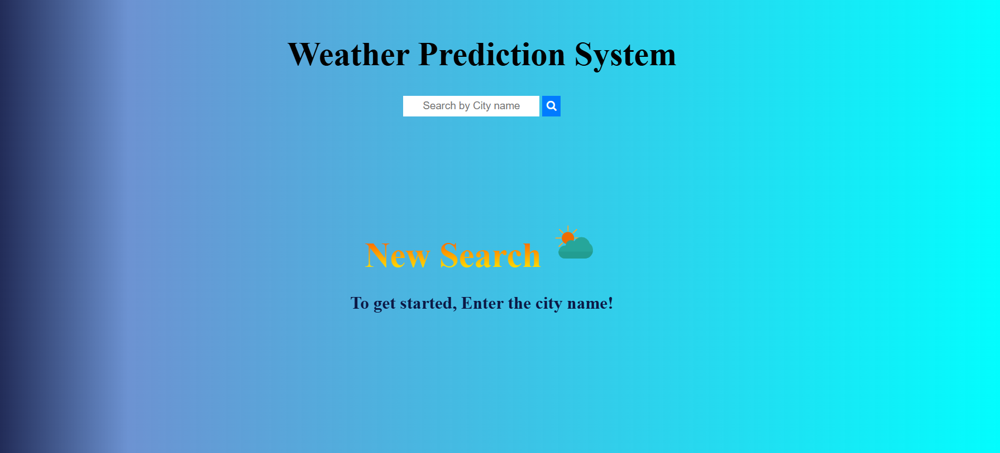
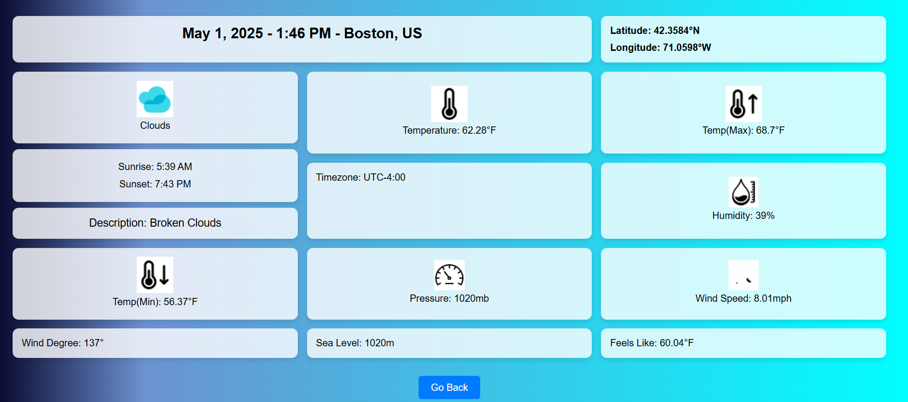

# Weather Prediction Web Application

Access: https://srivarshini277.github.io/WeatherPredictionUsingWebAPI/

A lightweight, user-friendly web application that allows users to search for real-time weather information for any city around the world using the OpenWeather API.

## Features

- **Real-time Weather Data**: Get current weather conditions for any city worldwide
- **Detailed Weather Information**: View comprehensive weather details including:
  - Temperature (current, min, max, feels like)
  - Humidity and pressure
  - Wind speed and direction
  - Sunrise and sunset times (adjusted to local timezone)
  - Weather description with visual icons
  - Location coordinates with directional indicators
  - Timezone information
- **Responsive Design**: Works on desktop and mobile devices
- **Dynamic Weather Icons**: Visual representation of current weather conditions
- **Location-based Time**: Displays date and time adjusted to the searched location's timezone

## Technologies Used

- HTML5
- CSS3
- JavaScript (Vanilla JS)
- OpenWeather API (via RapidAPI)
- Session Storage for data persistence

## Usage Guide

1. **Search for a City**
   - Enter a city name in the search box
   - Press Enter or click the search button
   - The application will fetch and display weather information for the specified city

2. **View Weather Details**
   - Once the weather data is loaded, you'll be redirected to the info page
   - The page displays comprehensive weather information including temperature, humidity, wind data, etc.
   - Weather conditions are visually represented with animated icons

3. **Navigate Back**
   - Click the "Back to Home" button to return to the search page
  
  ## Setup Instructions

1. **Clone the repository**
   ```
   git clone https://github.com/yourusername/weather-prediction-app.git
   cd weather-prediction-app
   ```

2. **API Key Configuration**
   - Sign up for a free account at [RapidAPI](https://rapidapi.com/)
   - Subscribe to the "OpenWeather13" API
   - Replace the API key in the `getWeatherData()` function:
     ```javascript
     const options = {
         method: 'GET',
         headers: {
             'x-rapidapi-key': 'YOUR_RAPIDAPI_KEY',
             'x-rapidapi-host': 'open-weather13.p.rapidapi.com'
         }
     };
     ```

3. **Launch the application**
   - Open `index.html` in your browser to use the application
   - For development, you can use a local server like Live Server (VS Code extension)
     
## Project Structure

```
weather-prediction-app/
├── index.html          # Main search page
├── info.html           # Weather information display page
├── css/
│   └── style.css       # Stylesheet for the application
├── js/
│   ├── script.js       # Main JavaScript file for index.html
│   └── info.js         # JavaScript file for info.html
└── images/             # Weather icons and animations
    ├── clouds.gif
    ├── drizzle.gif
    ├── mist.png
    ├── rain.gif
    ├── snow.gif
    ├── sun.gif
    ├── thunderstorm.gif
    └── tornado.png
```

## Error Handling

The application includes error handling for:
- Empty search inputs
- City not found in the API
- API connection issues
- Missing or incomplete weather data

## Browser Compatibility

- Chrome (latest)
- Firefox (latest)
- Safari (latest)
- Edge (latest)

## Acknowledgments

- Weather data provided by [OpenWeather API](https://openweathermap.org/)

## Application Preview




